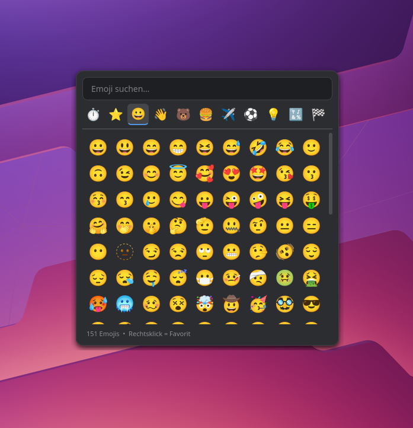

# 🎨 Emoji Picker

A fast, KDE-styled emoji picker for **Wayland** (KDE Plasma 6) with direct insertion.

Built because the default KDE emoji picker can't directly insert emojis under Wayland, doesn't auto-close after selection, and has no favorites.



## Features

- ✅ **Direct insertion** — emojis are pasted directly into the focused window (via `ydotool`)
- ✅ **Auto-close** — closes after selecting an emoji
- ✅ **Categories** — Smileys, People, Animals, Food, Travel, Activities, Objects, Symbols, Flags
- ✅ **Favorites** — right-click any emoji to add/remove as favorite
- ✅ **Recently used** — automatically tracked
- ✅ **Search** — with German and English terms (e.g. "auto", "car", "lachen", "laugh")
- ✅ **Color emojis** — rendered via Cairo/Pango (not Qt's broken text rendering)
- ✅ **Dark theme** — matches KDE Breeze Dark
- ✅ **Focus-loss close** — click outside to dismiss
- ✅ **Lightweight** — no daemon, no background process, starts on demand

## Requirements

- **Debian 13 (Trixie)** / KDE Plasma 6 / Wayland
- Should also work on other Debian-based distros with Wayland + KDE

The install script handles all dependencies automatically.

## Installation

```bash
git clone https://github.com/jockel09/emoji-picker.git
cd emoji-picker
chmod +x install.sh
./install.sh
```

The installer will:
1. Check and install missing packages (`python3-pyqt6`, `python3-cairo`, `python3-gi`, `ydotool`, `wl-clipboard`)
2. Set up `ydotool` (user service + input group)
3. Install the picker to `~/.local/share/emoji-picker/`
4. Create a launcher at `~/.local/bin/emoji-picker`
5. Add a `.desktop` file

> **Note:** If you were added to the `input` group during installation, you need to **log out and back in** for `ydotool` to work.

## Keyboard Shortcut

Set up a global shortcut in KDE:

1. **System Settings** → **Shortcuts** → **+ Add New** → **Command**
2. **Command:** `emoji-picker`
3. **Shortcut:** `Meta+.` (or whatever you prefer)
4. Disable the default KDE emoji picker shortcut first

## Usage

| Action | Description |
|---|---|
| **Click** an emoji | Insert it directly into the focused app |
| **Right-click** an emoji | Toggle favorite ⭐ |
| **Type** in search | Filter by name (German + English) |
| **Escape** | Close the picker |
| **Click outside** | Close the picker |

### Search examples

| Search | Finds |
|---|---|
| `auto` | 🚗 🚘 🚙 |
| `car` | 🚗 🚘 🚙 |
| `herz` | ❤️ 🧡 💛 💚 💙 💜 ... |
| `lachen` | 😀 😃 😄 😆 😅 🤣 😂 |
| `bier` | 🍺 🍻 |
| `deutschland` | 🇩🇪 |
| `pizza` | 🍕 |
| `katze` / `cat` | 🐱 🐈 😺 ... |

## Configuration

Settings are stored in `~/.config/emoji-picker/config.json`:

```json
{
  "favorites": ["😂", "❤️", "👍"],
  "recent": ["😀", "🎉"],
  "max_recent": 36,
  "columns": 9,
  "close_on_select": true,
  "insert_method": "ydotool"
}
```

## Uninstall

```bash
cd emoji-picker
chmod +x uninstall.sh
./uninstall.sh
```

## How it works

The default KDE emoji picker (and most Linux emoji pickers) can only copy emojis to the clipboard under Wayland, because Wayland's security model doesn't allow apps to simulate keyboard input via the `zwp_virtual_keyboard_v1` protocol (KWin doesn't support it).

This picker works around the limitation by:
1. Copying the emoji to the clipboard via `wl-copy`
2. Simulating `Ctrl+V` via `ydotool` (which operates on `/dev/uinput`, bypassing Wayland restrictions)

Color emoji rendering uses **Cairo/Pango** instead of Qt's text engine, because PyQt6 can't render color emoji fonts properly.

## Tech stack

- **Python 3** + **PyQt6** — UI
- **Cairo/Pango** (via `python3-gi`) — color emoji rendering
- **ydotool** — keyboard simulation on Wayland
- **wl-clipboard** — clipboard access

## License

MIT License — see [LICENSE](LICENSE) for details.
