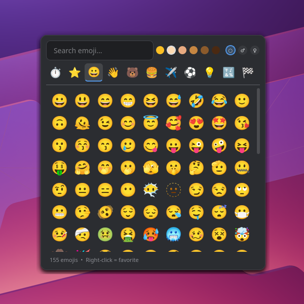

# 🎨 Emoji Picker

A fast, KDE-styled emoji picker for **Wayland** (KDE Plasma 6) — ⚡ **with direct insertion**.

Built because the default KDE emoji picker can't directly insert emojis under Wayland, doesn't auto-close after selection, and has no favorites.



## Features

- ✅ **Direct insertion** — emojis are pasted directly into the focused window (via `ydotool`)
- ✅ **Auto-close** — closes after selecting an emoji
- ✅ **Multi-insert** — hold `Shift` to collect several emojis and insert them in one go
- ✅ **Categories** — Smileys, People, Animals, Food, Travel, Activities, Objects, Symbols, Flags
- ✅ **Favorites** — right-click any emoji to add/remove as favorite
- ✅ **Recently used** — automatically tracked
- ✅ **Search** — with German and English terms (e.g. "auto", "car", "lachen", "laugh")
- ✅ **Skin tone selector** — 6 Fitzpatrick tones, applied to all compatible emojis
- ✅ **Gender selector** — neutral / ♂ / ♀, combinable with skin tone
- ✅ **Localization** — English and German included, easily extensible
- ✅ **Kaomoji support** — optional tab with text-based emoticons, fully customizable via `kaomoji.json`
- ✅ **Keyboard navigation** — fully operable without a mouse
- ✅ **Color emojis** — rendered via Cairo/Pango (not Qt's broken text rendering)
- ✅ **Dark theme** — with the accent color picked up from your KDE settings
- ✅ **Focus-loss close** — click outside to dismiss
- ✅ **Lightweight** — no daemon, no background process, starts on demand

## Requirements

- **Debian 13 (Trixie)** / KDE Plasma 6 / Wayland
- Should also work on other Debian/Ubuntu-based, Fedora-based, or Arch-based distros with Wayland + KDE

The install script handles all dependencies automatically.

## Installation

### Debian / Ubuntu package

The simplest route:

```bash
curl -LO https://github.com/jockel09/emoji-picker/releases/latest/download/emoji-picker_latest_all.deb
sudo apt install ./emoji-picker_latest_all.deb
emoji-picker-setup
```

That URL always points at the newest release. Versioned packages for every release are on the [releases page](https://github.com/jockel09/emoji-picker/releases).

`apt` pulls in every dependency. Then run `emoji-picker-setup` **as yourself, not with `sudo`** — it adds you to the `input` group, which is what grants write access to `/dev/uinput`, and no package install can do that for you. It is safe to run again at any time and reports whatever is still missing.

> **Debian users:** `ydotool` is only in **backports**, so a stock Debian 13 doesn't have it — which is why it is a `Recommends` and not a hard dependency: the package installs either way. `emoji-picker-setup` notices it is absent, says that enabling backports changes your package sources, and offers to do it. Decline and the picker still works, just copying to the clipboard; run the command again whenever you change your mind.
>
> With backports already enabled, `apt` pulls `ydotool` in along with the package by itself.

Build it yourself with `./build-deb.sh` — the version comes from the latest git tag, and the result lands in `dist/`. Pushing a `v*` tag builds it in CI and attaches it to the release automatically.

### With git

```bash
git clone https://github.com/jockel09/emoji-picker.git
cd emoji-picker
chmod +x install.sh
./install.sh
```

### From a source archive, without git

```bash
curl -L https://github.com/jockel09/emoji-picker/archive/refs/heads/master.tar.gz | tar xz
cd emoji-picker-master
chmod +x install.sh
./install.sh
```

That is the current code rather than a pinned release. For a specific version, take its source archive from the [releases page](https://github.com/jockel09/emoji-picker/releases) — those extract into a directory named after the tag without the leading `v`, e.g. `emoji-picker-1.3.1`.

### What install.sh does

Unlike the package, the script runs as you, so it handles the per-user setup itself.

1. Check and install missing packages (`python3-pyqt6`, `python3-cairo`, `python3-gi`, `wl-clipboard`, the Noto colour emoji font)
2. Install `ydotool` and set it up (user service + input group)
3. Install the picker to `~/.local/share/emoji-picker/`
4. Create a launcher at `~/.local/bin/emoji-picker`
5. Add a `.desktop` file

> **Note:** If you were added to the `input` group during installation, you need to **log out and back in** for direct insertion to work.

> **Debian users:** `ydotool` is only in **backports**, so a stock Debian 13 doesn't have it. The installer notices, tells you that enabling backports changes your package sources, and offers to do it. Decline and it finishes anyway — the picker then copies to the clipboard instead of inserting, and prints the commands to add `ydotool` later.

## Keyboard Shortcut

Set up a global shortcut in KDE:

1. **System Settings** → **Keyboard** → **Shortcuts** → **+ Add New** → **Command**
2. **Command:** `emoji-picker`
3. **Shortcut:** `Meta+.` (or whatever you prefer)
4. Disable the default KDE emoji picker shortcut first

## Usage

| Action | Description |
|---|---|
| **Click** an emoji | Insert it directly into the focused app |
| **Shift+click** emojis | Collect several, insert them all when you release `Shift` — see [multi-insert](#inserting-several-emojis-at-once) |
| **Right-click** an emoji | Toggle favorite ⭐ |
| **Type** in search | Filter by name (German + English) |
| **Escape** | Close the picker (inserts collected emojis in multi-insert mode) |
| **Click outside** | Close the picker (same) |

### Keyboard navigation

| Key | Action |
|---|---|
| `Tab` | Jump from search field to emoji grid |
| `Arrow keys` | Navigate within the emoji grid |
| `Enter` / `Space` | Insert the focused emoji |
| `Shift+Enter` | Collect the focused emoji; releasing `Shift` inserts the collection |
| `F` | Toggle favorite on focused emoji |
| `Del` | Remove focused emoji from Recents or Favorites |
| `Ctrl+←` / `Ctrl+→` | Switch category (also works in empty search field) |
| `Alt+←` / `Alt+→` | Move focused emoji left/right within Favorites |
| `Backspace` | Take back the last collected emoji (empty search field) |

### Search examples

| Search | Finds |
|---|---|
| `auto` | 🚗 🚘 🚙 |
| `car` | 🚗 🚘 🚙 |
| `herz` | ❤️ 🧡 💛 💚 💙 💜 ... |
| `lachen` | 😀 😃 😄 😆 😅 🤣 😂 |
| `bier` | 🍺 🍻 |
| `deutschland` | 🇩🇪 |
| `pizza` | 🍕 |
| `katze` / `cat` | 🐱 🐈 😺 ... |

## Configuration

Settings are stored in `~/.config/emoji-picker/config.json`:

```json
{
  "favorites": ["😂", "❤️", "👍"],
  "max_recent": 36,
  "columns": 9,
  "close_on_select": true,
  "insert_method": "ydotool",
  "skin_tone": "",
  "gender": "",
  "language": "en",
  "kaomoji": false,
  "theme": "auto"
}
```

Recently used emojis are stored separately in `~/.local/share/emoji-picker/recent.json` so dotfile managers (chezmoi, stow) can ignore it independently of the config.

To use German, set `"language": "de"`. Custom languages can be added by creating a new file in the `locales/` directory.

### Inserting several emojis at once

Hold `Shift` while picking. No configuration needed:

1. **Keep `Shift` held** and click (or press `Enter` on) as many emojis as you like. The picker stays open and shows the collection at the bottom.
2. `Backspace` takes back the last one, as long as the search field is empty.
3. **Let go of `Shift`** — everything is inserted at once as a single string and the picker closes.

`Escape` or clicking outside also inserts the collection, and picking one more emoji without `Shift` appends it and finishes. So you are never stuck holding the key.

Nothing is inserted until you finish. That's deliberate: under Wayland the simulated `Ctrl+V` always lands in whichever window has focus, so the picker would have to hide and reappear for every single emoji. Collecting first means it steps aside exactly once.

A `Shift` press that didn't pick anything is ignored, so typing capital letters in the search field won't close the picker.

Set `"close_on_select": false` to make collecting the default — then every pick collects, `Shift` isn't needed, and `Escape` or clicking outside inserts everything. In that mode releasing `Shift` does nothing, since it isn't what started the collection.

### Theme

| Value | Behaviour |
|---|---|
| `auto` (default) | Read the accent color from `~/.config/kdeglobals` |
| `dark` | Always use the built-in accent (`#5294e2`) |

The accent is used for the search field focus border, the active category underline and selection highlights. The rest of the palette is the built-in dark theme in both cases.

The color is read once per launch, so a change in **System Settings → Colors** shows up the next time you open the picker. If `kdeglobals` is missing or unreadable — on non-KDE desktops, for instance — the built-in accent is used.

### Kaomoji

Set `"kaomoji": true` to enable the Kaomoji tab (ツ). On first launch, a default set is written to `~/.config/emoji-picker/kaomoji.json`. Add your own by editing that file:

```json
[
  {"text": "¯\\_(ツ)_/¯", "name": "shrug"},
  {"text": "(╯°□°）╯︵ ┻━┻", "name": "table flip"}
]
```

Kaomoji are searchable by name and can be added to favorites just like regular emojis.

## Uninstall

```bash
cd emoji-picker
chmod +x uninstall.sh
./uninstall.sh
```

## How it works

The default KDE emoji picker (and most Linux emoji pickers) can only copy emojis to the clipboard under Wayland, because Wayland's security model doesn't allow apps to simulate keyboard input via the `zwp_virtual_keyboard_v1` protocol (KWin doesn't support it).

This picker works around the limitation by:
1. Copying the emoji to the clipboard via `wl-copy`
2. Simulating `Ctrl+V` via `ydotool` (which operates on `/dev/uinput`, bypassing Wayland restrictions)

Color emoji rendering uses **Cairo/Pango** instead of Qt's text engine, because PyQt6 can't render color emoji fonts properly.

## Tech stack

- **Python 3** + **PyQt6** — UI
- **Cairo/Pango** (via `python3-gi`) — color emoji rendering
- **ydotool** — keyboard simulation on Wayland
- **wl-clipboard** — clipboard access

## License

MIT License — see [LICENSE](LICENSE) for details.
